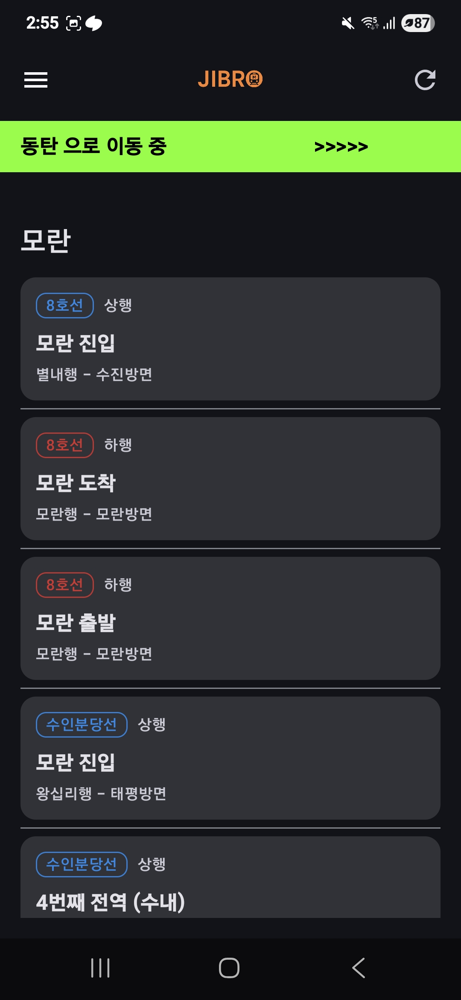
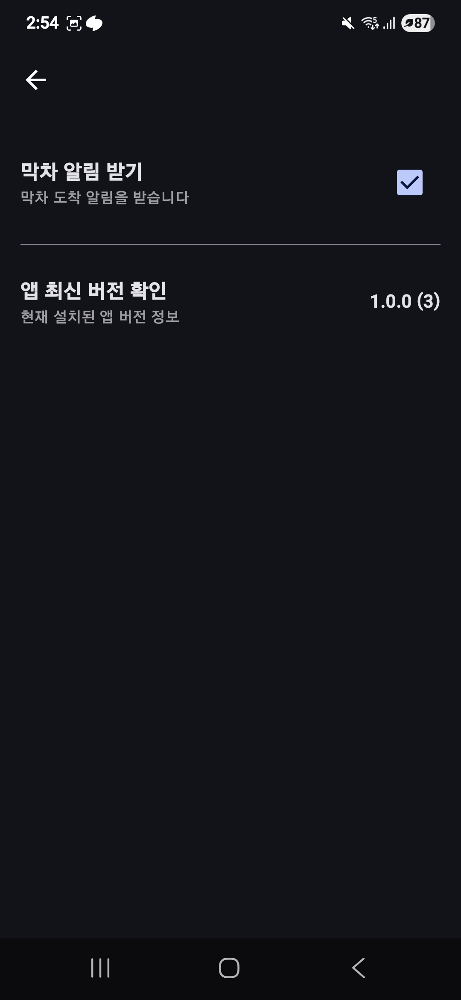
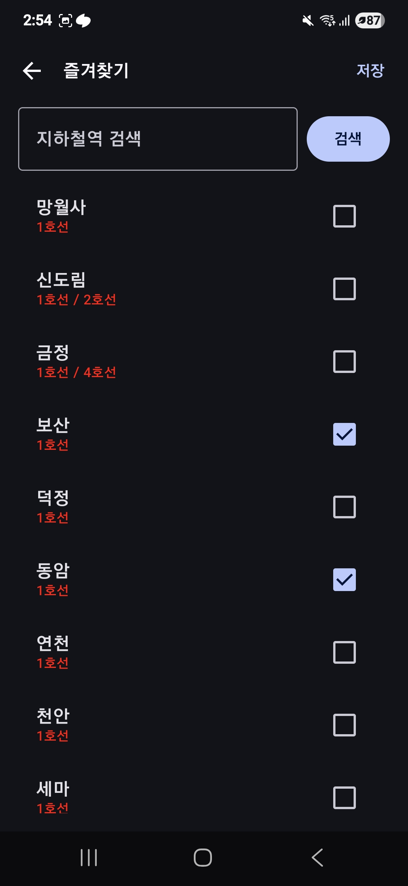
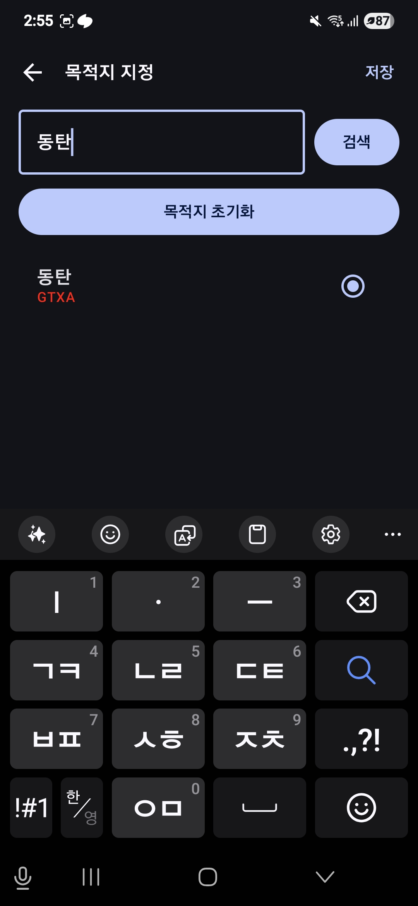
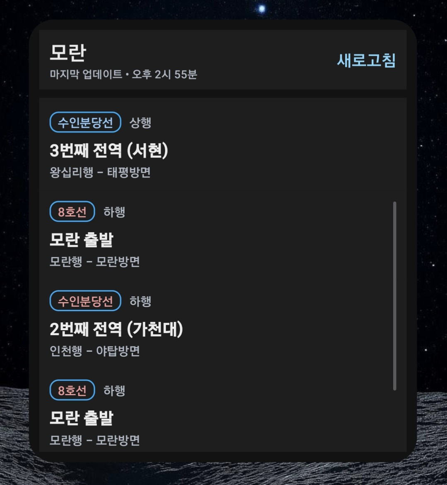

# Jibro
인근 지하철역의 도착 정보를 확인하고 막차, 목적지 도착 알림을 받을 수 있는 서비스입니다.<br />
<br />
Play Store : https://play.google.com/store/apps/details?id=com.windrr.jibrro&pli=1
<br />
<br />
## 프로젝트 구조
<details>
<summary>폴더 트리 보기</summary>

```text
app/src/main/java/com/windrr/jibrro
├── data
│   ├── api
│   │   └── SubwayService.kt
│   ├── db
│   │   ├── SubwayDao.kt
│   │   └── SubwayDatabase.kt
│   ├── di
│   │   ├── DataStoreModule.kt
│   │   ├── DatabaseModule.kt
│   │   ├── LocalDataModule.kt
│   │   ├── NetworkModule.kt
│   │   ├── RemoteDataModule.kt
│   │   └── RepositoryModule.kt
│   ├── model
│   │   ├── AlarmInfo.kt
│   │   ├── CheckStation.kt
│   │   ├── Destination.kt
│   │   ├── ErrorMessage.kt
│   │   ├── RealtimeArrival.kt
│   │   ├── SubwayArrivalResponse.kt
│   │   ├── SubwayInfo.kt
│   │   └── SubwayStation.kt
│   ├── repository
│   │   ├── datasource
│   │   │   ├── SettingsLocalDataSource.kt
│   │   │   ├── StationDataSource.kt
│   │   │   ├── SubwayArrivalRemoteDataSource.kt
│   │   │   └── SubwayLocalDataSource.kt
│   │   ├── datasourceImpl
│   │   │   ├── SettingsLocalDataSourceImpl.kt
│   │   │   ├── StationDataSourceImpl.kt
│   │   │   ├── SubwayArrivalRemoteDataSourceImpl.kt
│   │   │   └── SubwayLocalDataSourceImpl.kt
│   │   └── repositoryImpl
│   │       ├── AlarmRepositoryImpl.kt
│   │       ├── CheckStationRepositoryImpl.kt
│   │       ├── SettingsRepositoryImpl.kt
│   │       ├── StationRepositoryImpl.kt
│   │       └── SubwayRepositoryImpl.kt
│   └── util
│       └── SubwayInfo.kt
├── di
├── domain
│   ├── di
│   │   └── UseCaseModule.kt
│   ├── repository
│   │   ├── AlarmRepository.kt
│   │   ├── CheckStationRepository.kt
│   │   ├── SettingsRepository.kt
│   │   ├── StationRepository.kt
│   │   └── SubwayRepository.kt
│   ├── state
│   │   ├── LocationState.kt
│   │   └── Result.kt
│   └── usecase
│       ├── DeleteStationUseCase.kt
│       ├── GetCheckStationListUseCase.kt
│       ├── GetClosestStationUseCase.kt
│       ├── GetDestinationUseCase.kt
│       ├── GetLastLocationUseCase.kt
│       ├── GetLastTrainNotificationUseCase.kt
│       ├── GetStationListUseCase.kt
│       ├── GetSubwayArrivalDataUseCase.kt
│       ├── RegisterAlarmUseCase.kt
│       ├── SaveStationListUseCase.kt
│       ├── SetDestinationUseCase.kt
│       ├── SetLastLocationUseCase.kt
│       └── SetLastTrainNotificationUseCase.kt
├── infrastructure
│   ├── AppCore.kt
│   ├── BootReceiver.kt
│   ├── JibroWorker.kt
│   ├── LocationForegroundService.kt
│   ├── LocationHelper.kt
│   └── di
│       └── LocationModule.kt
├── presentation
│   ├── activity
│   │   ├── LikeStationActivity.kt
│   │   ├── MainActivity.kt
│   │   ├── SettingsActivity.kt
│   │   ├── SplashActivity.kt
│   │   └── ui
│   │       └── theme
│   │           ├── Color.kt
│   │           ├── Theme.kt
│   │           └── Type.kt
│   ├── alarm
│   │   └── AlarmReceiver.kt
│   ├── component
│   │   ├── AlarmPermissionModal.kt
│   │   ├── BannerAdView.kt
│   │   ├── DestinationBanner.kt
│   │   ├── LocationPermissionDialog.kt
│   │   └── LocationPermissionPreviewModal.kt
│   ├── ui
│   │   └── theme
│   │       ├── Color.kt
│   │       ├── Theme.kt
│   │       └── Type.kt
│   ├── viewmodel
│   │   ├── CheckStationViewModel.kt
│   │   ├── SettingsViewModel.kt
│   │   ├── StationViewModel.kt
│   │   └── SubwayArrivalDataViewModel.kt
│   └── widget
│       ├── ArrivalInfoWidget.kt
│       ├── ArrivalInfoWidgetReceiver.kt
│       ├── action
│       │   └── RefreshAction.kt
│       └── di
│           └── WidgetEntryPoint.kt
└── util
    ├── Action.kt
    └── DistanceUtil.kt
```
</details>

클린 아키텍처를 지향하는 형태로 구성되었습니다.

### Data : 실제 데이터의 저장, 네트워크 통신, 외부 데이터 소스와의 연결을 담당합니다.
  - repository/ : Domain 레이어의 Repository 인터페이스 구현체와 실제 로컬 및 API를 통해 데이터를 가져오는 Source로 구성되어 있습니다.
  - api/ : 서버 API 통신을 위한 Service가 구성
  - db/ : ROOM 데이터베이스와 DAO
  - model/ : 네트워크 통신 및 DB에 사용되는 각종 데이터 모델로 구성
  - util/ : 데이터 관련 유틸리티

### Domain : 외부 라이브러리나 프레임워크에 의존하지 않고, 앱의 비즈니스 로직들로 구성됩니다.
  - usecase/ : 하나의 기능 단위로 비즈니스 로직을 구현
  - repository/ : 데이터 접근을 추상화하는 인터페이스

### Infrastructure : 서비스, 브로드캐스트 리시버 등 안드로이드 시스템과 직접적으로 연관된 기능을 담당합니다.

### Presentation : 사용자 인터페이스(UI)와 관련된 코드들로 구성됩니다.
  - activity/ : 액티비티(화면 진입점)
  - component/ : Jetpack Compose 등 UI 컴포넌트
  - widget/ : 위젯 관련 코드
  - viewmodel/ : 화면 상태 및 UI 로직을 담당하는 ViewModel
<br />

## 사용 기술 스택
  - Retrofit: 서울 지하철 정보 api를 통해 데이터를 수신받고 앱에서 필요한 형태로 변환하는 역할
  - Hilt : 의존성 주입 자동화를 통해 수동으로 객체 생성 등의 보일러 플레이트 감소 역할
  - Room : 사용자가 즐겨찾기로 등록한 지하철 역을 로컬에 저장하고 관리하는 역할
  - Data Store : 사용자의 알람 설정 및 목적지 설정에 대한 정보를 로컬에 저장하고 관리하는 역할
  - WorkManaer : 백그라운드로 사용자 인근 지하철 역 도착 정보를 주기적으로 확인하여 막차 정보에 따라 알람을 보내는 역할
  - Compose & Glance : 인앱 UI 및 위젯을 구현하는데 사용
<br />

## 화면별 주요 기능
### 메인화면

<table>
  <tr>
    <td width="360">
      
    </td>
    <td>

**위치 기반 기능**
- LocationHelper를 사용해 사용자의 현재 위치(위도, 경도)를 가져옵니다.
- 가장 가까운 지하철 역을 찾아 그에 대한 도착 정보 목록을 가장 최상단 섹션으로 보여줍니다.

**즐겨찾기 기반 지정 지하철역 도착 정보 목록 제공**
- CheckStationViewModel을 통해 사용자가 저장한 즐겨찾는 역 목록을 관리합니다.
- 저장된 역 목록을 DB에 저장된 순서대로 섹션 구분하여 LazyColumn으로 보여줍니다.
- SubwayArrivalDataViewModel을 사용해 지하철 도착 정보를 가져오고 Card 아이템으로 표시합니다.
- 막차의 경우 우측 상단 스티커 라벨을 Card에 추가 표시합니다.

**목적지 이동 중 표시**
- SettingsViewModel을 통해 DataStore에서 등록된 목적지가 있는 검사하고 포그라운드 서비스 및 배너 표시 설정을 관리합니다.
- DestinationBanner 컴포넌트를 통해 이동 중이라는 정보를 애니메이션 스타일로 나타냅니다.

**사이드 메뉴**
- DismissibleNavigationDrawer로 사이드 메뉴를 표시합니다.
- 설정, 즐겨찾는 역 관리 등의 기능에 접근할 수 있습니다.

**데이터 동기화**
- 상단 수동 동기화 버튼을 통해 현재 목록에 지정된 지하철 역들의 모든 최신 도착 정보를 수신 받을 수 있습니다.
  
    </td>
  </tr>
</table>

### 설정 화면

<table>
  <tr>
    <td width="360">
      
    </td>
    <td>

**앱 버전 정보 표시**
- packageManager를 사용해 앱 정보를 가져오고, 현재 설치된 앱의 버전 이름과 버전 코드를 표시합니다.
- 클릭 시, Jibro의 플레이 스토어 화면으로 이동합니다.
  
**막차 알림 설정**
- CheckBox 클릭으로 SettingsViewModel을 통해 막차 알림 설정을 관리합니다.
- 해당 Bool 값을 저장함으로서 AlarmReceiver에서 필요에 따라 가장 가까운 지하철 역에 막차 정보가 뜨는 순간 알림을 팝업합니다.
  
    </td>
  </tr>
</table>

### 즐겨찾기 지정 화면

<table>
  <tr>
    <td width="360">
      
    </td>
    <td>

**즐겨찾기 선택 기능**
- 다중 선택이 가능한 체크 박스 리스트로 사용자가 원하는 지하철 역을 즐겨찾기로 등록해두고, 메인화면에서 도착 정보를 확인할 수 있습니다.
- 저장 버튼을 클릭하면서 CheckStationViewModel을 통해 즐겨찾기 목록을 관리합니다.
- 빠른 저장을 위해 지하철 역 검색 기능을 제공합니다.
  
    </td>
  </tr>
</table>

### 목적지 지정 화면

<table>
  <tr>
    <td width="360">
      
    </td>
    <td>

**목적지 선택 기능 제공**
- 라디오 버튼 형식으로 하나의 선택만 가능하도록 지원합니다.
- 목적지 선택 후, 저장 클릭 시 SettingsViewModel을 통해 저장됩니다.
- 목적지 초기화 버튼을 통해 기존 목적지 정보를 Clear 할 수 있습니다.
- 즐겨찾기와 동일한 화면 공유를 통해 역시 검색 기능을 제공합니다.
  
    </td>
  </tr>
</table>

### 인근 지하철 역 도착 정보 위젯

<table>
  <tr>
    <td width="360">
      
    </td>
    <td>

**현재 위치 기반 역 조회**
- LocationHelper를 사용해 사용자의 현재 위치를 가져옵니다.
- GetClosestStationUseCase 역 목록을 로드하고, 가장 가까운 역을 찾습니다.

**도착 정보 조회**
- GetSubwayArrivalDataUseCase를 사용해 선택된 역의 실시간 도착 정보를 가져온 뒤, LazyColumn으로 목록을 표시합니다.
- Result 타입을 사용해 로딩, 성공, 실패 상태를 처리하고 그에 따른 UI가 갱신됩니다.

**수동 동기화 기능**
- 새로고침 버튼을 통해 RefreshAction을 RefreshAction을 호출하고, Widget Update를 통해 최신 데이터로 갱신합니다.
- 마지막 업데이트 시간을 표시하여 사용자에게 데이터 최신화 여부를 확인 가능하도록 지원합니다.
  
    </td>
  </tr>
</table>

## 추후 추가 기능 및 수정 사항
- Widget Init 상황에서 즉시 데이터 Fetch 안되는 문제 처리
- LikeStationActivity UI 개선
- 최근 검색 목록 시스템 구성
- TTS 기반 목적지 알림 구현
